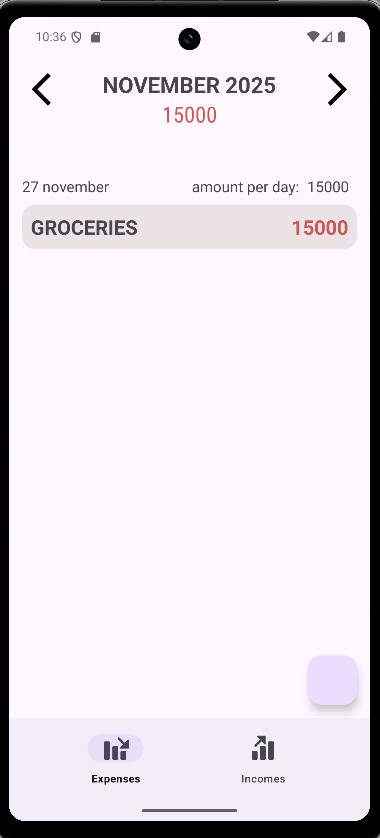
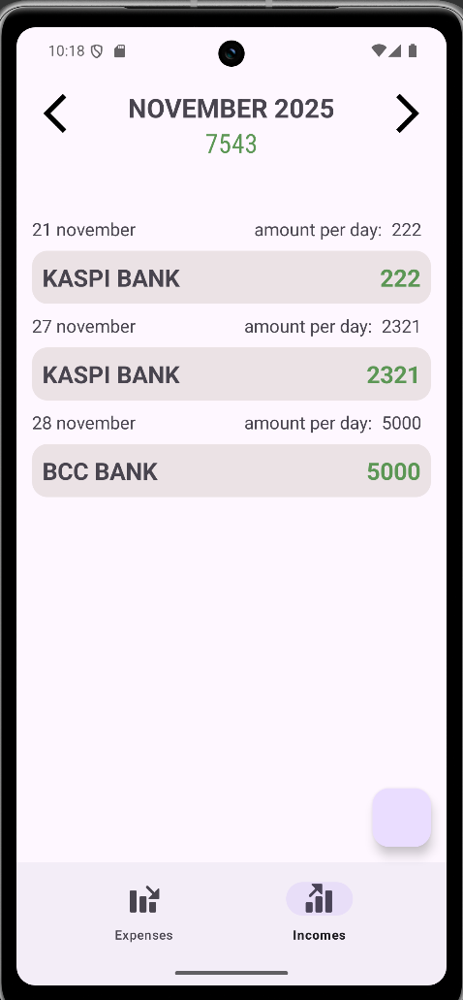
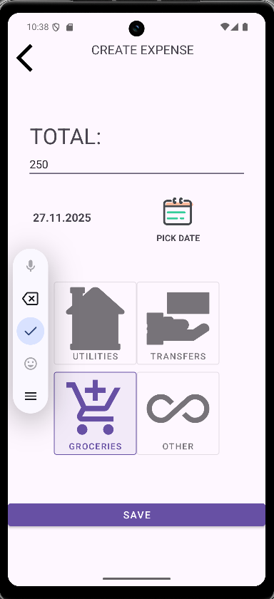
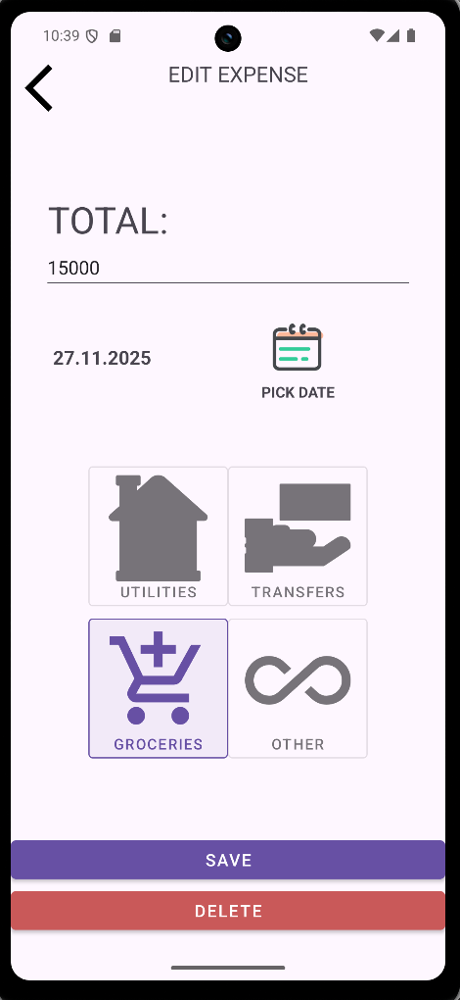

FinUp - Budget and Finance Tracker
FinUp is a Kotlin-based Android application for monthly tracking of incomes and expenses.

🛠️ Application Features
Monthly Budgeting: Calculation and display of total income and expense for the current month.

Month Navigation: Ability to navigate to data from previous and future periods to view statistics.

Financial Management (CRUD Operations): Full management of incomes and expenses, including Creation, Editing, and Deletion of transactions.

Interface: Design based on Material Components and View.

💻 Tech Stack and Testing - 

Technology -
1. Language - Kotlin
2. UI - View
3. Architecture - MVVM, Manual DI
4. Unit Testing - JUnit
5. UI Testing -	Espresso
6. Jetpack	ViewModel, LiveData
7. Data Persistence - Room, DataStore
8. Asynchrony	- Coroutines
9. Robolectric for mock Bundle

⚙️ Build and Run Instructions

Clone the repository: 

git clone https://github.com/scope658/FinUp.git

Open the project in Android Studio and wait for Gradle to sync.

Click the Run button (▶️) to deploy the app to an emulator or device.

🧪 Running UI Tests (Espresso)
To successfully run UI tests, they must be isolated from external factors like system time, which is critical for month-dependent logic.

Important Step:

You need to open the ProvideViewModel.Base class and manually change the time provider being used: instead of DateProviderImpl, you should use FakeDateProviderImpl to inject fake time into the components.

Screenshots ->

| Expenses page | Incomes page | Create page | Edit page |
|---------------|------------|------------|--------------|
|  |  |  |  |

